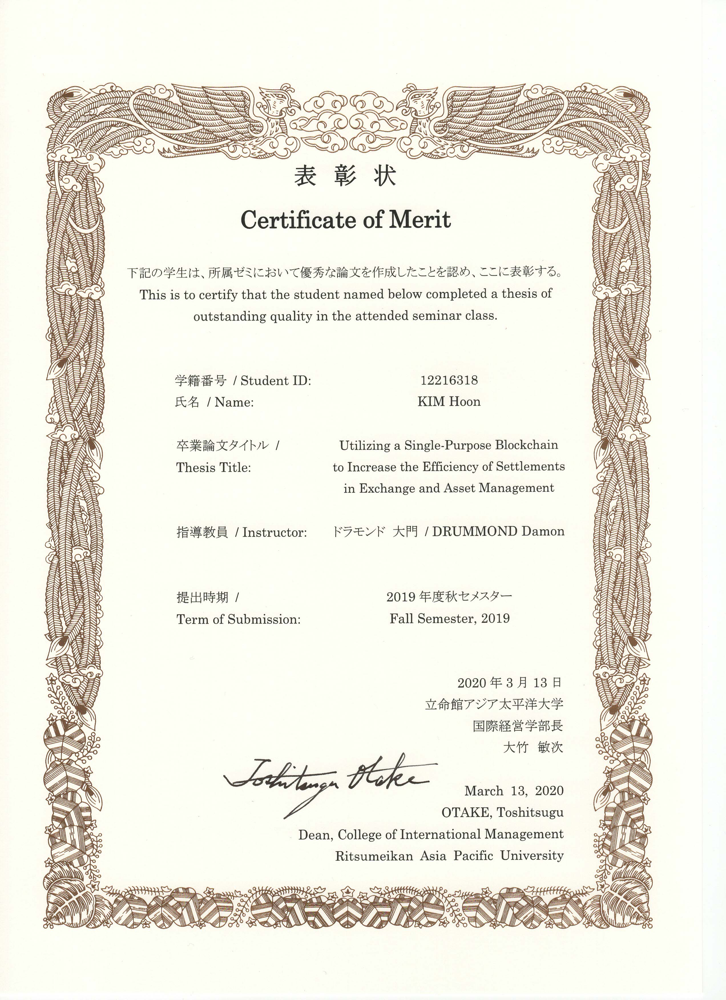

# Substrate Stock Exchange Platform

A stock exchange platform made with substrate for undergrad thesis.

## Limitations of the current build

- It only supports sell/buy limit order. Market order is technically
  possible if there are enough traders and transactions in the market,
  but for now I only track the market value.

## Public Functions

- Put sell/buy order
- Give issue rights (substitute for IPO) (sudo)
- Revoke issue rights (sudo)
- Change authorized shares (sudo)
- Issue shares
- Retire shares
- Freeze/unfreeze market (sudo)
  (sudo means the caller must have sudo keys)

## How to run/hack the node

First, use the following command to install Rust and the WASM toolchain

    curl https://sh.rustup.rs -sSf | sh
    rustup target add wasm32-unknown-unknown --toolchain nightly

Next, use the following command to build the node

    ./exchange_platform/scripts/build.sh && cargo build --release

You can run the developer node with the following command

    ./exchange_platform/target/release/exchange_platform --dev

Happy hacking!

## About the thesis

This is a project developed for an Undergraduate thesis for Ritsumeikan Asia Pacific University College of International Management written by Hoon Kim.
This thesis has received the Outstanding Thesis Award in the Undergraduate category.

